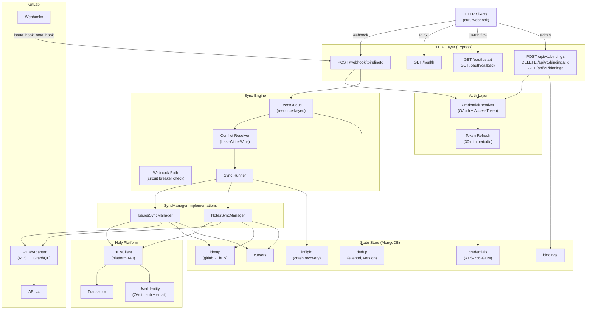
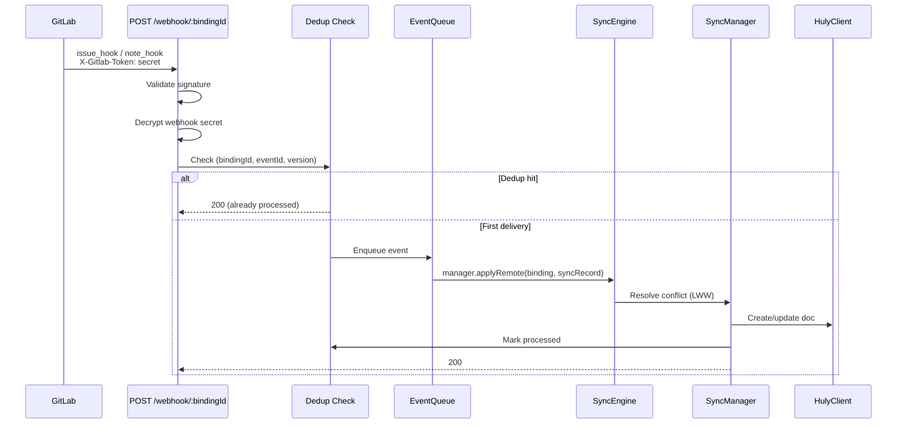
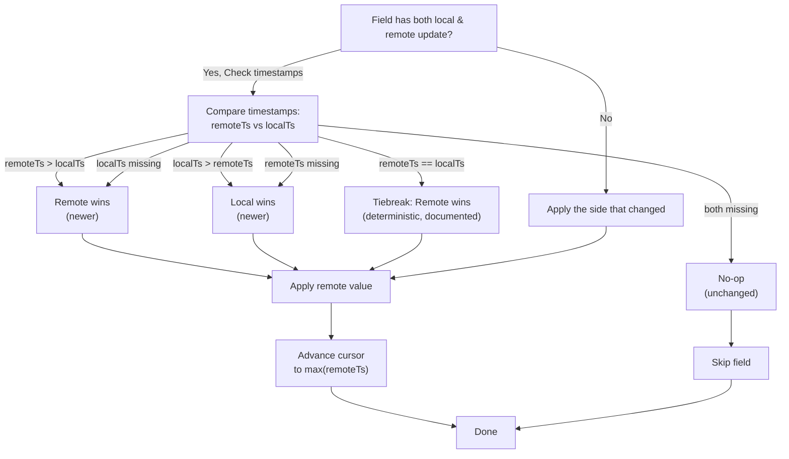
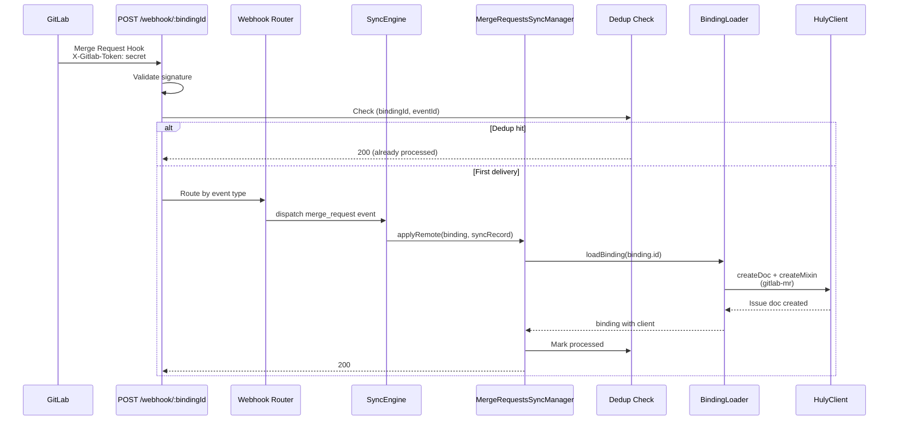
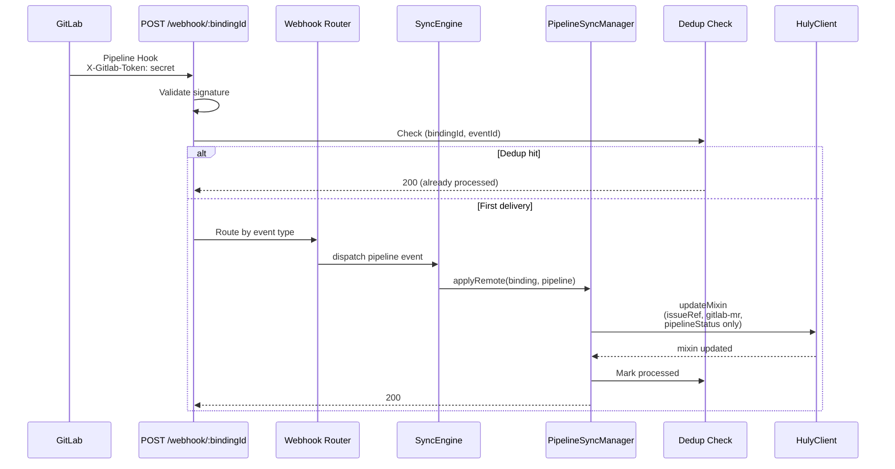
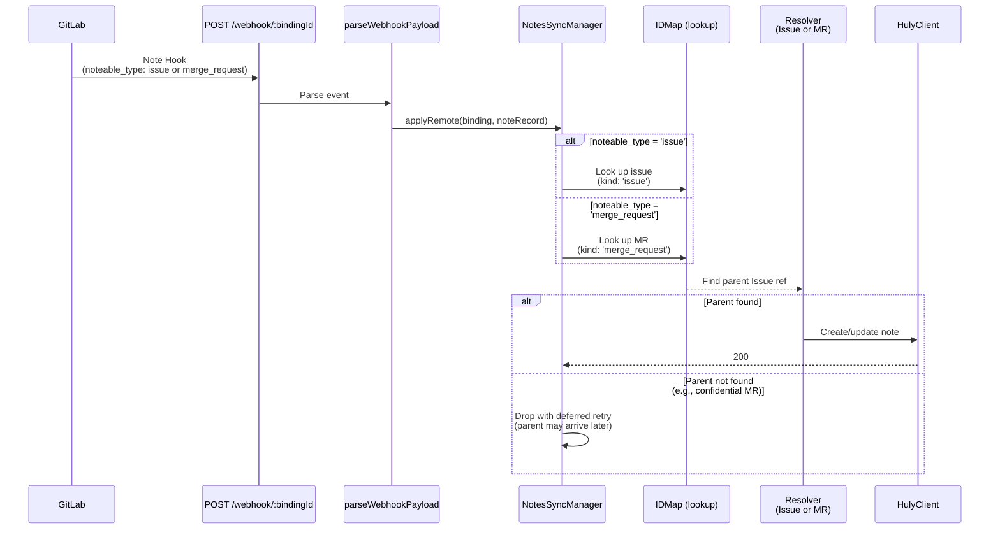

# Architecture

## System Layers



## State Collections


## Webhook Event Flow



## Conflict Resolution Decision Tree



## Polling-Always Semantics

The **BackfillScheduler** runs every `BackfillIntervalMs` (default 5 minutes) for **all non-disabled bindings**, regardless of webhook registration status.

**Rationale:**
- Webhooks provide **speed** (immediate notifications).
- Polling provides **reliability** (defense-in-depth against missed webhook deliveries).
- Combining both ensures eventual consistency without relying on webhook availability.

**Circuit Breaker (shared between engine and scheduler):**
- When a binding experiences 5 consecutive backfill failures, the breaker opens for 15 minutes.
- While OPEN: webhook events for that binding are dropped with a `gitlab.breaker.dropped.webhook` metric, preventing cascade failures.
- After 15 minutes, breaker enters HALF_OPEN for one probe; on success, resets to CLOSED.

## Capability Detection

GitLab features vary between versions (CE vs EE) and between 16.x vs 17.x. The adapter detects capabilities on first use:

```
GET /api/v4/version         → Parse { version, edition }
GraphQL introspection ping  → Test available queries
Cache result for 1 hour
```

**Feature Flags (explicit closed set):**

| Flag | Consumer | Purpose |
|------|----------|---------|
| `graphql.issue.notes` | `NotesSyncManager` (T-11) | Batch-fetch notes via GraphQL when available |
| `graphql.issue.batchedNotes` | `GitLabAdapter` (T-04) | Use batched note queries in GraphQL path |

## Credential Encryption

Credentials (OAuth tokens, access tokens, webhook secrets) are stored encrypted in MongoDB:

**Algorithm:** AES-256-GCM  
**Key:** `CREDENTIAL_ENCRYPTION_KEY` (32-byte base64, validated at startup)  
**IV:** Random per credential  
**Auth Tag:** Included in ciphertext for authenticated decryption

**Types:**
- `oauth` — OAuth2 access token + refresh token
- `access_token` — GitLab personal access token (group or project scope)
- `webhook_secret` — Per-binding shared secret (32 raw bytes, 44 base64 chars)

## User Identity Mapping

Two identity strategies:

1. **OAuth-authenticated users** → Social key format `gitlab:{oauth_subject}`  
   - Immutable even if user renames on GitLab
   - Populated when user completes OAuth flow

2. **Email-matched (no OAuth)** → Social key format `email:{lowercased_email}`  
   - Fallback when GitLab user does not have OAuth auth
   - Requires email address from GitLab API

**Stub Guest Creation (R9 dedup):**
- When no match found, create a stub `contact.class.Person` in Huly
- Deduplicate on `(workspaceUuid, gitlabUserId)` — avoid duplicate stubs if the same GitLab user appears in multiple issues
- Stub carries runtime marker `{gitlabUserId, gitlabUsername, gitlabWebUrl}` (NOT a model mixin)

## Confidential Issues (Q5 Resolution)

Confidential issues and notes are **deliberately excluded from Phase 1** because Huly's ACL model does not yet support GitLab-style confidentiality.

**Filtering points:**
1. Webhook subscription: Pod does NOT subscribe to `confidential_issues_events` or `confidential_note_events`
2. Webhook dispatch: If a confidential issue/note arrives anyway (edge case), drop with metric `gitlab.confidential.skipped`
3. Backfill: `GitLabAdapter.listIssues()` and `listNotes()` filter out `confidential: true` results; emit metric per skipped row

**Metrics:** `gitlab.confidential.skipped` incremented per filtered issue/note

## Markdown Round-Trip

GitLab's GFM (GitHub-Flavored Markdown) ↔ Huly's ProseMirror markup:

1. **GitLab → Huly**: `parseGfmMarkdown(gfm, refUrl)` → ProseMirror AST → Huly markup JSON
2. **Huly → GitLab**: `markupToGfmMarkdown(markup)` → GFM

**Attachment Link-Through (Phase 1):**
- Markdown links like `/uploads/abc/file.png` and `https://gitlab.example/group/proj/-/uploads/...` survive round-trip **byte-identical** as plain references
- No upload proxy or mirror in Phase 1

## Rate Limiting & Retry

The GitLab adapter's `TokenBucket` respects:

- `Retry-After` header (RFC 7233 integer seconds OR HTTP-date format)
- `RateLimit-*` headers (GitLab's `X-RateLimit-*` variant)
- Exponential backoff: base 500ms, factor 2, max 5 retries, cap 30s

On 429 (Too Many Requests), the adapter automatically retries with backoff before surfacing the error to the caller.

---

## Phase 2 Additions

### Merge Request Webhook Flow



### Pipeline Webhook Flow



### Notes Sync with Noteable Type Routing



### Runtime Mixin Model for Merge Requests

The `gitlab-mr` mixin is a **runtime-only mixin** (not a registered model) carried on `tracker.class.Issue`. It is applied at sync time via `TxOperations.createMixin()` or `updateMixin()` and persists in Huly's transactor without requiring model registration.

**Why runtime-only:** Phase 1 learned (Q5) that out-of-tree model registration on Huly's platform has tight constraints. Runtime mixins avoid this: they are ephemeral types visible only within this integration's lifecycle, not part of Huly's core schema.

**Field ownership (no overlap):**
- **MergeRequestsSyncManager owns:** `sourceBranch`, `targetBranch`, `draft`, `mergedAt`, `mergeStatus`, `webUrl`
- **PipelineSyncManager owns:** `pipelineStatus`
- **Invariant:** MR sync never touches `pipelineStatus`; pipeline sync never touches the other six fields. This prevents stale MR webhook from overwriting fresh pipeline status.

**Mixin structure example:**
```json
{
  "sourceBranch": "feature/add-auth",
  "targetBranch": "main",
  "draft": false,
  "mergedAt": "2026-06-05T10:30:00Z",
  "mergeStatus": "can_be_merged",
  "webUrl": "https://gitlab.example/group/project/-/merge_requests/42",
  "pipelineStatus": "success"
}
```

### State Collections — Phase 2 Widening

The `idmap` and `cursors` collections' `kind` enums widen in Phase 2:

**idmap.kind additions:**
- `'merge_request'` — Maps GitLab merge request IID to the Huly Issue doc carrying the `gitlab-mr` mixin.
- `'pipeline'` — Stores a single entry per binding per pipeline (projectId, pipelineId) → `null` (no Huly doc, used for dedup only).

**cursors.kind additions:**
- `'merge_requests'` — Backfill cursor for `listMergeRequests`; stores `max(updated_at)` of processed MRs.
- `'pipelines'` — Backfill cursor for `listPipelines` (future use; Phase 2 pipelines are webhook-only).

**notes cursor is shared:** The `'notes'` cursor stores `max(updated_at)` across both issue notes and MR notes. Both backfill paths use it as a lower bound. Phase 3 will split into `'issue_notes'` and `'mr_notes'` if performance metrics demand isolation.

### Defense-in-Depth Confidentiality Model (Phase 2)

GitLab confidential merge requests are filtered at three layers:

1. **Adapter layer** (`listMergeRequests`, `getMergeRequest`):
   - Both REST methods include `confidential: false` in request parameters.
   - Response loop includes a defense-in-depth filter: any row with `confidential: true` is dropped and logged as `gitlab.confidential.skipped` (metric with `kind: 'merge_request'`).

2. **Webhook registration** (adapter):
   - Webhook subscription explicitly omits `confidential_merge_requests_events`.
   - Binding initialization calls `registerProjectWebhook(..., { confidential_*_events: false })`.
   - Re-registration endpoint (`POST /api/v1/bindings/:id/re-register-webhook`) explicitly preserves `confidential_*_events: false` (B4 fix).

3. **MR-note parent resolution** (NotesSyncManager):
   - When a note arrives with `noteable_type: 'merge_request'`, the manager looks up the MR in `idmap`.
   - If the MR is confidential and never entered the sync (filtered at adapter), the lookup returns no mapping.
   - The note is dropped after a deferred retry (queued for re-attempt in 30s, assuming the parent MR may arrive late).
   - Logged as `gitlab.note.parent_not_found` (metric with `noteable_type: 'merge_request'`).

This three-layer approach ensures that:
- Even if a confidential MR somehow arrives at the webhook (edge case), it is filtered before idmap entry.
- Even if an MR-note for that MR arrives before the MR is recognized as confidential, the note drops cleanly without writing orphaned data.

---

## Phase 3 Planning Notes

- **Cursor split:** Split `'notes'` into `'issue_notes'` + `'mr_notes'` if backfill metrics show contention.
- **Pipeline backfill:** Implement backfill path for pipelines (Phase 2 is webhook-only; Phase 3 adds periodic catch-up).
- **Reviewers field:** Replace synthetic `gitlab:reviewer:<username>` labels with a typed `reviewers` field on the mixin.
- **MR creation from Huly:** Implement `applyLocal` intent capture and `createMergeRequest` flow.
