# Architecture

## System Layers

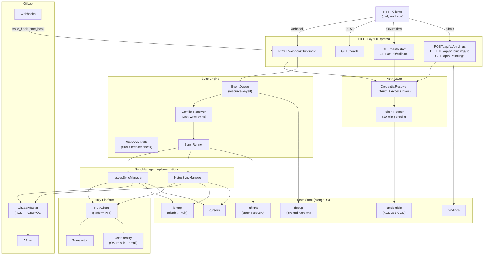

## State Collections

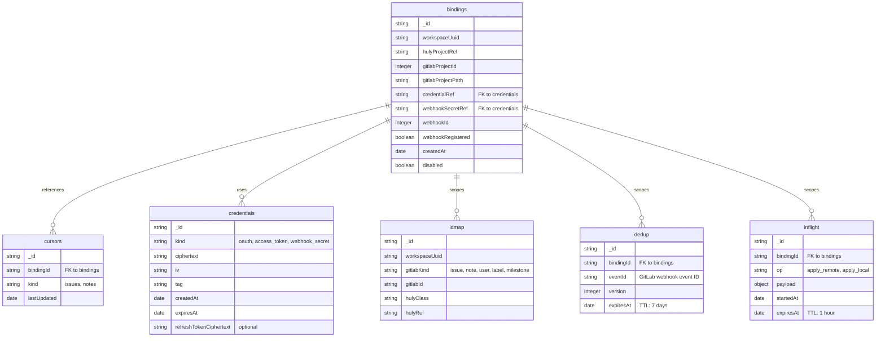

## Webhook Event Flow

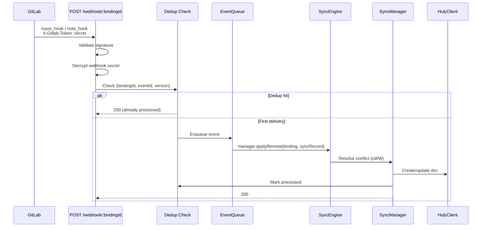

## Conflict Resolution Decision Tree

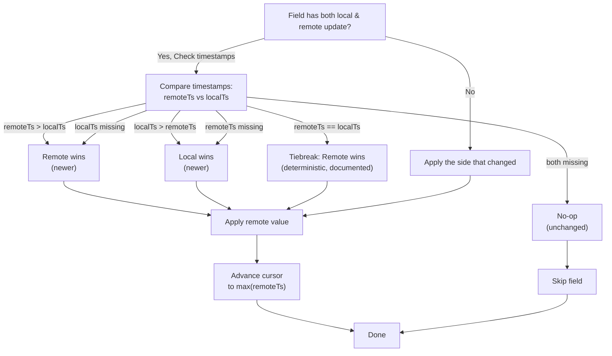

## Polling-Always Semantics

The **BackfillScheduler** runs every `BackfillIntervalMs` (default 5 minutes) for **all non-disabled bindings**, regardless of webhook registration status.

**Rationale:**
- Webhooks provide **speed** (immediate notifications).
- Polling provides **reliability** (defense-in-depth against missed webhook deliveries).
- Combining both ensures eventual consistency without relying on webhook availability.

**Circuit Breaker (shared between engine and scheduler):**
- When a binding experiences 5 consecutive backfill failures, the breaker opens for 15 minutes.
- While OPEN: webhook events for that binding are dropped with a `gitlab.breaker.dropped.webhook` metric, preventing cascade failures.
- After 15 minutes, breaker enters HALF_OPEN for one probe; on success, resets to CLOSED.

## Capability Detection

GitLab features vary between versions (CE vs EE) and between 16.x vs 17.x. The adapter detects capabilities on first use:

```
GET /api/v4/version         → Parse { version, edition }
GraphQL introspection ping  → Test available queries
Cache result for 1 hour
```

**Feature Flags (explicit closed set):**

| Flag | Consumer | Purpose |
|------|----------|---------|
| `graphql.issue.notes` | `NotesSyncManager` (T-11) | Batch-fetch notes via GraphQL when available |
| `graphql.issue.batchedNotes` | `GitLabAdapter` (T-04) | Use batched note queries in GraphQL path |

## Credential Encryption

Credentials (OAuth tokens, access tokens, webhook secrets) are stored encrypted in MongoDB:

**Algorithm:** AES-256-GCM  
**Key:** `CREDENTIAL_ENCRYPTION_KEY` (32-byte base64, validated at startup)  
**IV:** Random per credential  
**Auth Tag:** Included in ciphertext for authenticated decryption

**Types:**
- `oauth` — OAuth2 access token + refresh token
- `access_token` — GitLab personal access token (group or project scope)
- `webhook_secret` — Per-binding shared secret (32 raw bytes, 44 base64 chars)

## User Identity Mapping

Two identity strategies:

1. **OAuth-authenticated users** → Social key format `gitlab:{oauth_subject}`  
   - Immutable even if user renames on GitLab
   - Populated when user completes OAuth flow

2. **Email-matched (no OAuth)** → Social key format `email:{lowercased_email}`  
   - Fallback when GitLab user does not have OAuth auth
   - Requires email address from GitLab API

**Stub Guest Creation (R9 dedup):**
- When no match found, create a stub `contact.class.Person` in Huly
- Deduplicate on `(workspaceUuid, gitlabUserId)` — avoid duplicate stubs if the same GitLab user appears in multiple issues
- Stub carries runtime marker `{gitlabUserId, gitlabUsername, gitlabWebUrl}` (NOT a model mixin)

## Confidential Issues (Q5 Resolution)

Confidential issues and notes are **deliberately excluded from Phase 1** because Huly's ACL model does not yet support GitLab-style confidentiality.

**Filtering points:**
1. Webhook subscription: Pod does NOT subscribe to `confidential_issues_events` or `confidential_note_events`
2. Webhook dispatch: If a confidential issue/note arrives anyway (edge case), drop with metric `gitlab.confidential.skipped`
3. Backfill: `GitLabAdapter.listIssues()` and `listNotes()` filter out `confidential: true` results; emit metric per skipped row

**Metrics:** `gitlab.confidential.skipped` incremented per filtered issue/note

## Markdown Round-Trip

GitLab's GFM (GitHub-Flavored Markdown) ↔ Huly's ProseMirror markup:

1. **GitLab → Huly**: `parseGfmMarkdown(gfm, refUrl)` → ProseMirror AST → Huly markup JSON
2. **Huly → GitLab**: `markupToGfmMarkdown(markup)` → GFM

**Attachment Link-Through (Phase 1):**
- Markdown links like `/uploads/abc/file.png` and `https://gitlab.example/group/proj/-/uploads/...` survive round-trip **byte-identical** as plain references
- No upload proxy or mirror in Phase 1

## Rate Limiting & Retry

The GitLab adapter's `TokenBucket` respects:

- `Retry-After` header (RFC 7233 integer seconds OR HTTP-date format)
- `RateLimit-*` headers (GitLab's `X-RateLimit-*` variant)
- Exponential backoff: base 500ms, factor 2, max 5 retries, cap 30s

On 429 (Too Many Requests), the adapter automatically retries with backoff before surfacing the error to the caller.

---

## Phase 2 Additions

### Merge Request Webhook Flow

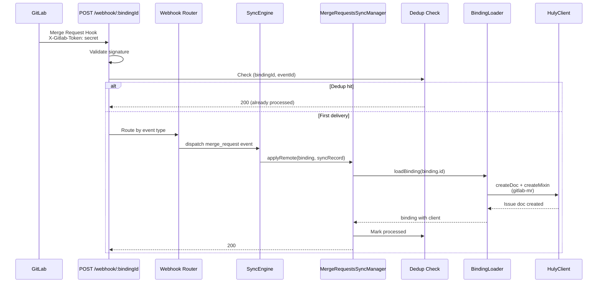

### Pipeline Webhook Flow

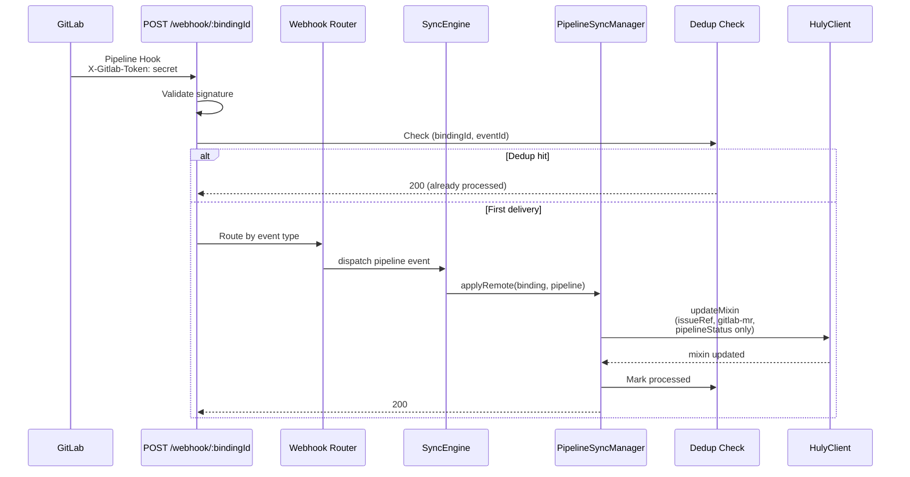

### Notes Sync with Noteable Type Routing

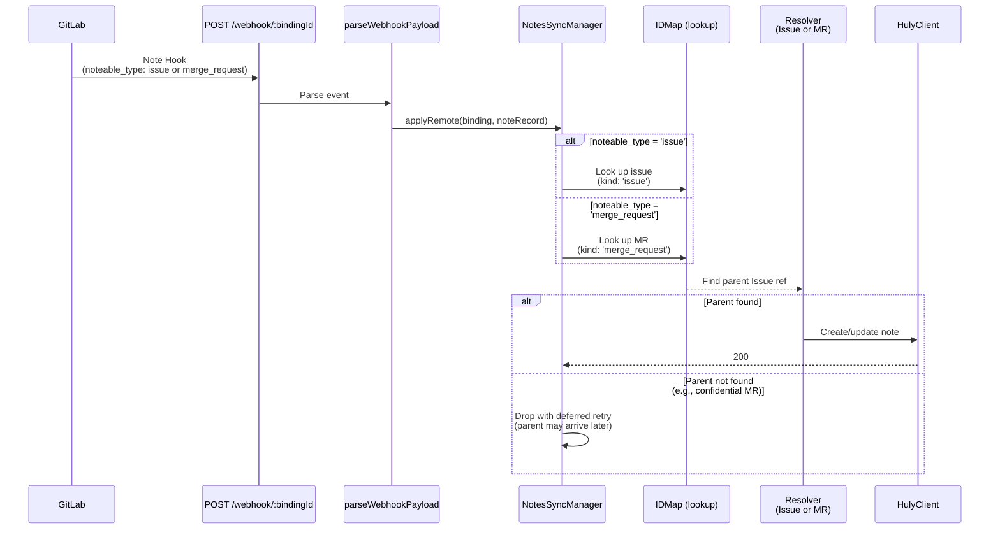

### Runtime Mixin Model for Merge Requests

The `gitlab-mr` mixin is a **runtime-only mixin** (not a registered model) carried on `tracker.class.Issue`. It is applied at sync time via `TxOperations.createMixin()` or `updateMixin()` and persists in Huly's transactor without requiring model registration.

**Why runtime-only:** Phase 1 learned (Q5) that out-of-tree model registration on Huly's platform has tight constraints. Runtime mixins avoid this: they are ephemeral types visible only within this integration's lifecycle, not part of Huly's core schema.

**Field ownership (no overlap):**
- **MergeRequestsSyncManager owns:** `sourceBranch`, `targetBranch`, `draft`, `mergedAt`, `mergeStatus`, `webUrl`
- **PipelineSyncManager owns:** `pipelineStatus`
- **Invariant:** MR sync never touches `pipelineStatus`; pipeline sync never touches the other six fields. This prevents stale MR webhook from overwriting fresh pipeline status.

**Mixin structure example:**
```json
{
  "sourceBranch": "feature/add-auth",
  "targetBranch": "main",
  "draft": false,
  "mergedAt": "2026-06-05T10:30:00Z",
  "mergeStatus": "can_be_merged",
  "webUrl": "https://gitlab.example/group/project/-/merge_requests/42",
  "pipelineStatus": "success"
}
```

### State Collections — Phase 2 Widening

The `idmap` and `cursors` collections' `kind` enums widen in Phase 2:

**idmap.kind additions:**
- `'merge_request'` — Maps GitLab merge request IID to the Huly Issue doc carrying the `gitlab-mr` mixin.
- `'pipeline'` — Stores a single entry per binding per pipeline (projectId, pipelineId) → `null` (no Huly doc, used for dedup only).

**cursors.kind additions:**
- `'merge_requests'` — Backfill cursor for `listMergeRequests`; stores `max(updated_at)` of processed MRs.
- `'pipelines'` — Backfill cursor for `listPipelines` (future use; Phase 2 pipelines are webhook-only).

**notes cursor is shared:** The `'notes'` cursor stores `max(updated_at)` across both issue notes and MR notes. Both backfill paths use it as a lower bound. Phase 3 will split into `'issue_notes'` and `'mr_notes'` if performance metrics demand isolation.

### Defense-in-Depth Confidentiality Model (Phase 2)

GitLab confidential merge requests are filtered at three layers:

1. **Adapter layer** (`listMergeRequests`, `getMergeRequest`):
   - Both REST methods include `confidential: false` in request parameters.
   - Response loop includes a defense-in-depth filter: any row with `confidential: true` is dropped and logged as `gitlab.confidential.skipped` (metric with `kind: 'merge_request'`).

2. **Webhook registration** (adapter):
   - Webhook subscription explicitly omits `confidential_merge_requests_events`.
   - Binding initialization calls `registerProjectWebhook(..., { confidential_*_events: false })`.
   - Re-registration endpoint (`POST /api/v1/bindings/:id/re-register-webhook`) explicitly preserves `confidential_*_events: false` (B4 fix).

3. **MR-note parent resolution** (NotesSyncManager):
   - When a note arrives with `noteable_type: 'merge_request'`, the manager looks up the MR in `idmap`.
   - If the MR is confidential and never entered the sync (filtered at adapter), the lookup returns no mapping.
   - The note is dropped after a deferred retry (queued for re-attempt in 30s, assuming the parent MR may arrive late).
   - Logged as `gitlab.note.parent_not_found` (metric with `noteable_type: 'merge_request'`).

This three-layer approach ensures that:
- Even if a confidential MR somehow arrives at the webhook (edge case), it is filtered before idmap entry.
- Even if an MR-note for that MR arrives before the MR is recognized as confidential, the note drops cleanly without writing orphaned data.

---

---

## Phase 3 Additions

### Review Thread Webhook Flow

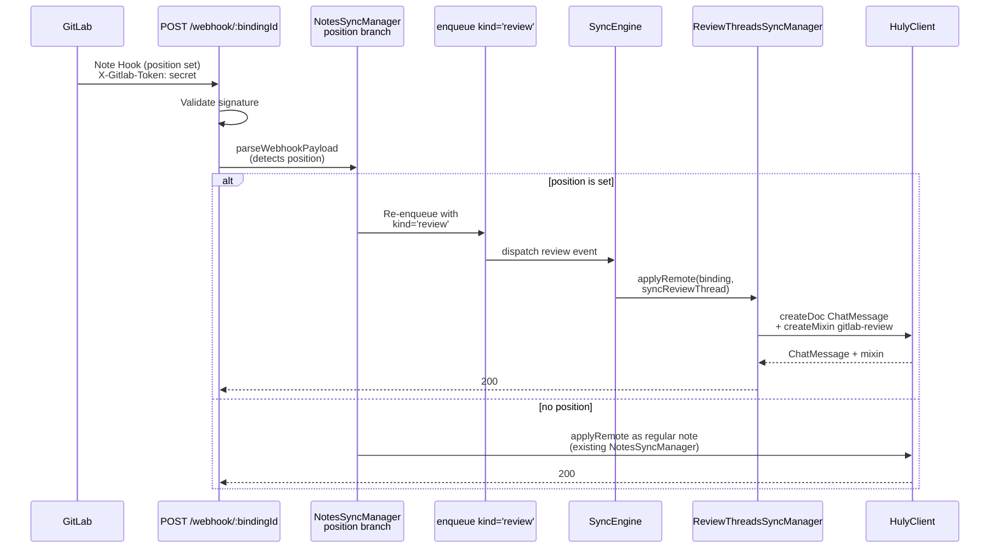

### Approval Webhook Flow (MR Hook)

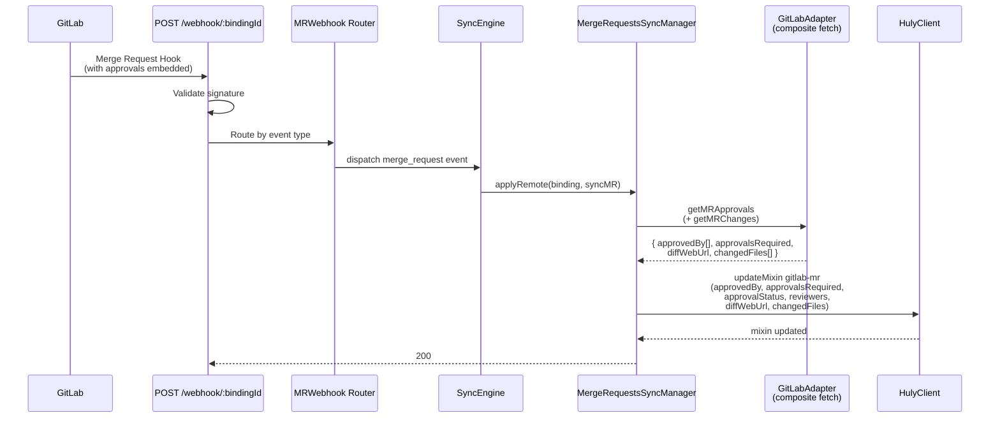

### Reviewer-Label Migration Flow

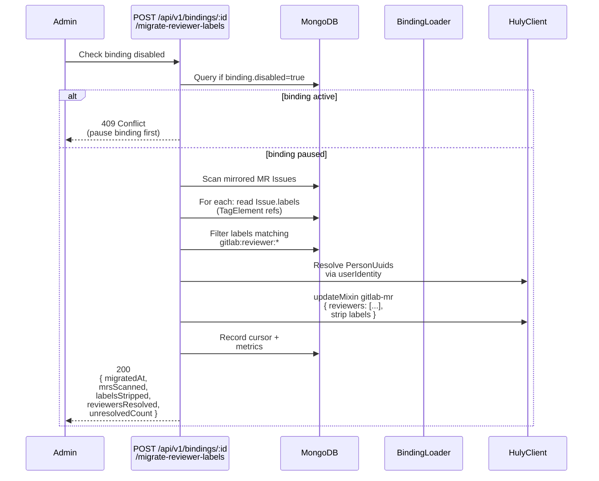

### Field Ownership: Phase 3 Mixin Partition

The `gitlab-mr` mixin fields are partitioned by manager with **zero overlap**:

| Field | Manager | Phase | Read-Only in Huly |
|-------|---------|-------|-------------------|
| `sourceBranch` | MergeRequestsSyncManager | 2 | Yes |
| `targetBranch` | MergeRequestsSyncManager | 2 | Yes |
| `draft` | MergeRequestsSyncManager | 2 | Yes |
| `mergedAt` | MergeRequestsSyncManager | 2 | No |
| `mergeStatus` | MergeRequestsSyncManager | 2 | Yes |
| `webUrl` | MergeRequestsSyncManager | 2 | Yes |
| `pipelineStatus` | PipelineSyncManager | 2 | Yes |
| `reviewers` | MergeRequestsSyncManager | 3 | No |
| `approvedBy` | MergeRequestsSyncManager | 3 | No |
| `approvalsRequired` | MergeRequestsSyncManager | 3 | Yes |
| `approvalStatus` | MergeRequestsSyncManager | 3 | Yes |
| `diffWebUrl` | MergeRequestsSyncManager | 3 | Yes |
| `changedFiles` | MergeRequestsSyncManager | 3 | Yes |

**Invariant:** If a future phase needs a field touched by multiple managers, split it into a separate mixin. This prevents field-ownership disputes and LWW race conditions.

**Review-Only Mixin:**

The `gitlab-review` mixin is carried ONLY on `chunter.class.ChatMessage` (review thread notes):

| Field | Owner | Type | Per-Note Storage |
|-------|-------|------|------------------|
| `threadId` | ReviewThreadsSyncManager | string | Replicated |
| `resolved` | ReviewThreadsSyncManager | boolean | Replicated |
| `resolvedBy` | ReviewThreadsSyncManager | PersonUuid \| null | Replicated |
| `resolvedAt` | ReviewThreadsSyncManager | number \| null | Replicated |
| `position` | ReviewThreadsSyncManager | SyncReviewPosition \| null | Root only; null for replies |

**Per-note storage (Q1 resolution):** Every ChatMessage in a thread carries the mixin. Thread state (`resolved`, `resolvedBy`, `resolvedAt`) is replicated across all notes for read-after-write consistency. Position is set ONLY on the first note (the discussion root); replies have `position: null`.

### State Collections — Phase 3 Widening

**idmap.kind additions:**
- `'review_thread'` — Maps GitLab discussion notes to Huly ChatMessages. **Compound key:** `"${discussionId}:${noteId}"` (per-note, not per-thread). Multiple notes in a thread produce multiple idmap rows sharing `discussionId`.

**cursors.kind additions:**
- `'reviews'` — Backfill cursor for `listDiscussions`; stores `max(updated_at)` of processed review threads per binding.

### Optional Fields Contract for `SyncMergeRequest`

Phase 3 introduces an important asymmetry in the adapter contract:

- **`listMergeRequests(projectId, opts)` returns:** `SyncMergeRequest` with the six Phase 3 fields (`reviewers`, `approvedBy`, `approvalsRequired`, `approvalStatus`, `diffWebUrl`, `changedFiles`) **left UNDEFINED** (not populated, not defaulted to empty arrays).
  
- **`getMergeRequest(projectId, iid)` returns:** All six Phase 3 fields **populated** when the auxiliary requests (`getMRApprovals`, `getMRChanges`) succeed; partial on any 404/5xx with `mr.composite.partial` metric increment.

**Why:** `listMergeRequests` is called frequently during backfill and polling; adding N+1 per-MR requests would explode API quota. Per-MR `get` is cheaper (called once on first encounter or when explicitly needed) and can be composed with other metadata.

**Consumer contract (applyRemote):** When a Phase 3 field is `undefined`, treat it as "not yet fetched" — do NOT write the mixin field and do NOT clear it to an empty value. This prevents intermediate states from clobbering typed reviewers during backfill→per-MR→subsequent sync cycles.

### Approval Attribution & Fallback

> **⚠️ Phase 3 limitation:** `applyLocal` code paths exist and are unit-tested but NO production `TxProcessor`/`TxMixin` subscription exists in `src/index.ts` that would feed real Huly mutations into `engine.enqueueLocalEvent`. Today these are reachable only via unit tests; Huly UI approve/unapprove clicks and discussion-resolution flips do NOT propagate to GitLab. Phase 4 will add the missing subscription. Until then, treat the GitLab adapter side as **read-only from Huly's perspective**.

**Per-user OAuth (preferred):**
- When a Huly user approves an MR (via the not-yet-wired Path B subscription), `applyLocal` calls `bctx.credentials.resolveActorToken(workspaceUuid, hulyPersonUuid)`.
- If stored: use that token in the `approveMR` request (attribution to the individual user on GitLab).
- Emit a success log with the user's identity.

**Service-account fallback (Phase 3 limitation Q2):**
- If no per-user token is stored: use the binding's service-account token.
- Emit a `warn` log: `approval.action.fallback.service_account`.
- Post a visibility comment on the parent Huly Issue: _"Approved via service account; per-user OAuth UI coming in Phase 4"_.

**Error handling:** On `ApprovalActionError` from the adapter, post a ChatMessage comment to the parent Issue with the error, then re-throw to the engine for retry.

### Operator-Pause Convention for Migration (Q3)

The reviewer-label migration endpoint requires the binding to be paused to prevent sync writes during label conversion:

1. Operator: `PATCH /api/v1/bindings/:id {disabled: true}`
2. Operator: `POST /api/v1/bindings/:id/migrate-reviewer-labels`
3. Migration returns 409 if binding is active; operator retries after pausing.
4. Operator: `PATCH /api/v1/bindings/:id {disabled: false}` to re-enable.

See [Phase 3 Migration Runbook](docs/phase3-runbook.md) for step-by-step instructions.

---

## Phase 4 Additions (FINAL)

### TxSubscriber Path B Flow

Path B closure wires Huly client mutations to GitLab via a subscription to the per-workspace Huly Client's transaction stream:

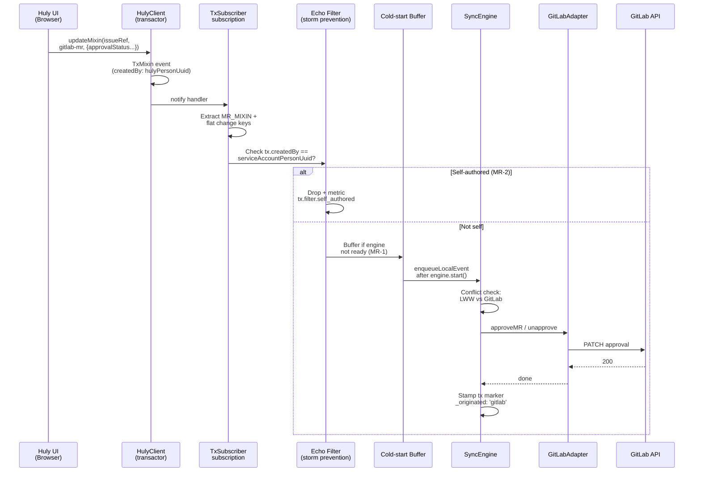

**Defense-in-depth (MR-2):** TxSubscriber filters out events authored by the pod's service-account PersonUuid (resolved at subscriber start via `resolveServiceAccountUser`). Additionally, `applyRemote` paths stamp a transient `_originated: 'gitlab'` marker on the attributes dict for outbound `createDoc`/`updateMixin` calls; the subscription can use this marker as a second-layer echo-storm prevention without reading service-account identity.

**Cold-start buffering (MR-1):** TxSubscriber begins accepting events immediately on subscription (even before `engine.start()` completes). Events received during startup are buffered (FIFO, bounded 1024 entries) and drained into `enqueueLocalEvent` AFTER engine.start() resolves. Overflow increments `tx.subscription.buffer.overflow` metric and drops oldest events.

**Lifecycle:** TxSubscriber is started on first `BindingLoader.loadFor*` per workspace; cached for 30-min TTL. Stopped on cache eviction or pod shutdown (via SIGTERM iteration in `src/index.ts`). All lifecycle wiring lives in P4-T-19 (not the core TxSubscriber class in P4-T-09).

### Per-user OAuth Flow

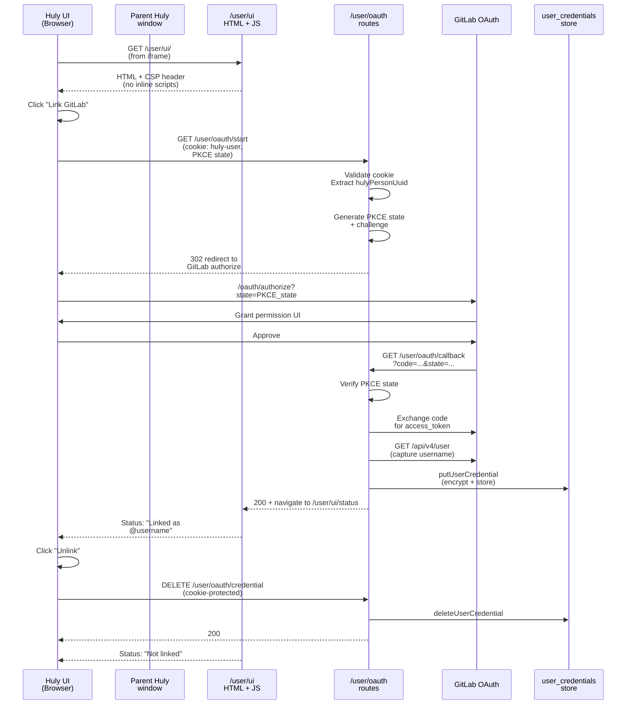

**Bearer transport (Bug-6):** Bearer tokens MUST arrive via `postMessage` from the embedding Huly parent window OR read from `sessionStorage` (set by the parent). Query-string bearer is REJECTED by the UI layer. CSP headers (`Content-Security-Policy: default-src 'none'; script-src 'wasm-unsafe-eval'`) on `/user/ui/*` prevent inline-script bearer exfiltration and external resource fetches.

**Cookie authentication (Bug-3):** The `huly-user` cookie uses a JSON+HMAC format: `${base64(json{hulyPersonUuid})}.${hmacSHA256(json, ServerSecret)}`. Single-secret HMAC validation (rotation requires pod restart).

**Rate limiting:** `/user/oauth/start` is rate-limited per IP (token bucket, default 5 req/min).

### Epic Webhook & Sync Flow

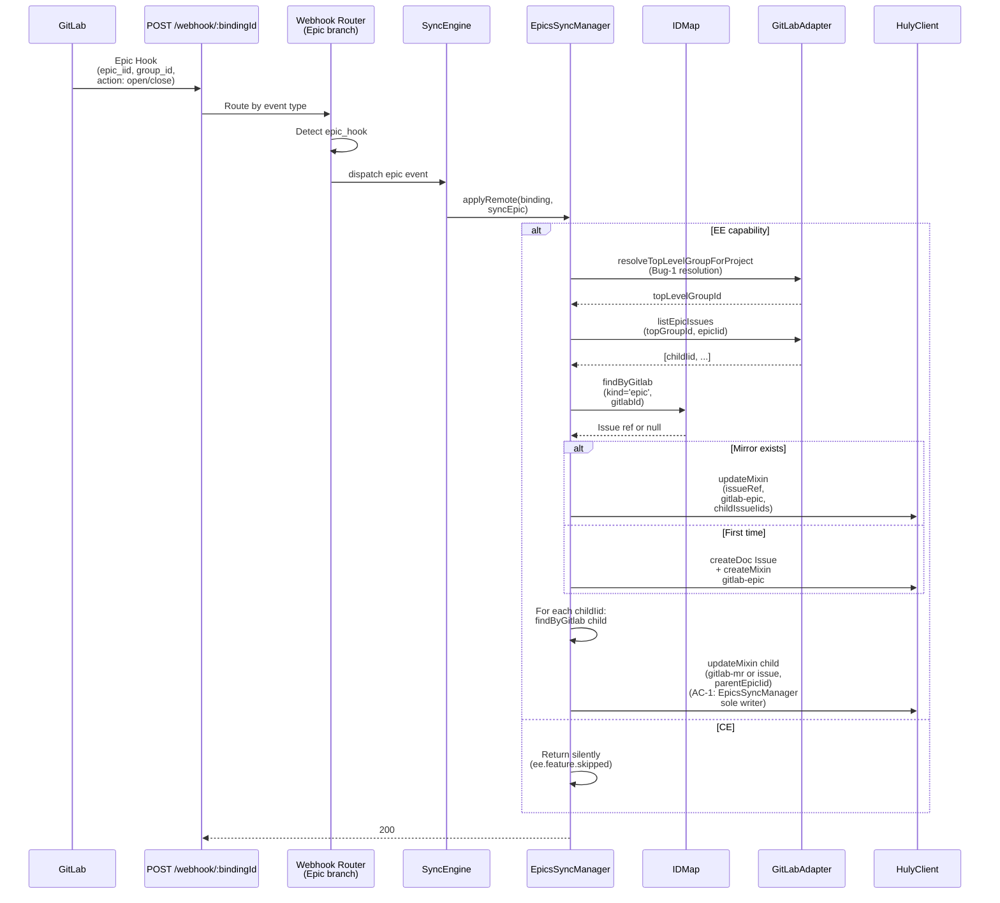

**Top-level group resolution (Bug-1):** Epics live on the top-level group, not the immediate sub-group. `resolveTopLevelGroupForProject` walks from project → namespace → iterates parents via `GET /api/v4/groups/:id` until `parent_id === null`. Result cached 1 hour per projectId.

**Field ownership (AC-1):** `EpicsSyncManager` EXCLUSIVELY owns the `gitlab-epic` mixin and is the SOLE writer of `parentEpicIid` (on child Issue mirrors via child-issue propagation). `MergeRequestsSyncManager` does NOT touch `parentEpicIid` on `gitlab-mr` — AC-1 single-writer invariant enforced by test assertions.

### Multi-instance Idmap Prefix

When a workspace binds to multiple GitLab instances, idmap `gitlabId` strings are prefixed with a stable 8-hex hash of `gitlabBaseUrl` (TG-4 defense-in-depth against duplicate project IDs across instances):

```
prefixGitlabIdForMultiInstance(baseUrl: string, raw: string, isMultiInstanceWorkspace: boolean): string
  - isMultiInstanceWorkspace=false → return raw (no prefix; zero behavior change in single-instance workspaces)
  - isMultiInstanceWorkspace=true  → return `${sha256(baseUrl).slice(0,8)}:${raw}`
```

**Example:**
- Workspace W binds to `https://gitlab.example.com` (project 42) and `https://gitlab-internal.company.com` (project 42, same ID)
- `isMultiInstanceWorkspace=true` detected on second binding
- idmap rows for first instance use prefix from `sha256('https://gitlab.example.com')` = `a1b2c3d4:42:7` (epic) or `a1b2c3d4:42` (merge request)
- idmap rows for second instance use prefix from `sha256('https://gitlab-internal.company.com')` = `e5f6g7h8:42:7`
- Collision-free even though both instances have project ID 42

**Single-instance workspaces** remain unprefixed (no retroactive migration required; Phase 4 limitation documented in runbook).

### Field Ownership: Phase 4 Mixin Partition

The `gitlab-mr` mixin now has 16 fields across four managers:

| Field | Manager | Phase | Read-Only |
|-------|---------|-------|-----------|
| `sourceBranch` | MergeRequestsSyncManager | 2 | Yes |
| `targetBranch` | MergeRequestsSyncManager | 2 | Yes |
| `draft` | MergeRequestsSyncManager | 2 | Yes |
| `mergedAt` | MergeRequestsSyncManager | 2 | No |
| `mergeStatus` | MergeRequestsSyncManager | 2 | Yes |
| `webUrl` | MergeRequestsSyncManager | 2 | Yes |
| `pipelineStatus` | PipelineSyncManager | 2 | Yes |
| `reviewers` | MergeRequestsSyncManager | 3 | No |
| `approvedBy` | MergeRequestsSyncManager | 3 | No |
| `approvalsRequired` | MergeRequestsSyncManager | 3 | Yes |
| `approvalStatus` | MergeRequestsSyncManager | 3 | Yes |
| `diffWebUrl` | MergeRequestsSyncManager | 3 | Yes |
| `changedFiles` | MergeRequestsSyncManager | 3 | Yes |
| `approvalRules` | MergeRequestsSyncManager | 4 | Yes |
| `iteration` | MergeRequestsSyncManager | 4 | No |
| `parentEpicIid` | EpicsSyncManager | 4 | No |

**AC-1 Invariant:** `parentEpicIid` is NEVER written by `MergeRequestsSyncManager` or any other manager. Only `EpicsSyncManager` writes this field (via child-issue propagation when processing an epic). Test assertions verify this partition.

**Phase 4 extensions:** `approvalRules` and `iteration` are written only by `MergeRequestsSyncManager` from composite `getMRApprovalRules` + `getIteration` calls on EE. `parentEpicIid` is written only by `EpicsSyncManager` during child-issue propagation.

### State Collections — Phase 4 Widening

**idmap.kind additions:**
- `'epic'` — Maps GitLab epic `(groupId, epicIid)` to Huly Issue mirror. **Compound key:** `"${groupId}:${epicIid}"`. Uses multi-instance prefix when applicable (TG-4).
- `'iteration'` — Maps GitLab iteration `iterationId` to `null` (no Huly doc; used for cursor-state only).
- `'approval_rule'` — Maps GitLab approval rule `(projectId, mrIid, ruleId)` to `null` (used for idempotency only).

**cursors.kind additions:**
- `'epics'` — Backfill cursor for `listEpics`; stores `max(updated_at)` of processed epics per binding.
- `'iterations'` — Backfill cursor for `listIterations`; stores `max(updated_at)` of processed iterations per binding.

**user_credentials collection (NEW):**
- `_id: ObjectId`
- `workspaceUuid: string`
- `hulyPersonUuid: string`
- `gitlabBaseUrl: string`
- `username: string` — GitLab username (SCG-2; captured at OAuth callback)
- `ciphertext, iv, tag` — AES-256-GCM encrypted access token
- `createdAt, expiresAt` — timestamps
- `refreshTokenCiphertext, iv, tag` — optional refresh token (same encryption)
- `expired: boolean` — permanence flag (refresh failures set this)
- **Unique index:** `{workspaceUuid, hulyPersonUuid, gitlabBaseUrl}`

---

## Phase 5 Additions

### Dual-Layer Echo Filter (Service-Account PersonId + `_originated` Marker)

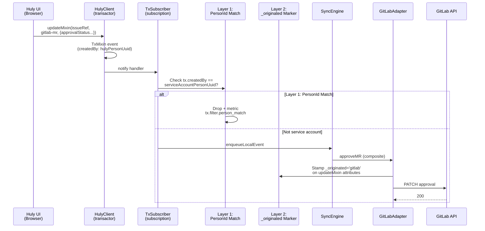

**Rationale:** Service-account PersonId detection is the primary filter (Path D). If TxSubscriber initialization fails to resolve service-account identity, or if a non-self event somehow passes, the `_originated: 'gitlab'` marker on applyRemote serves as fallback. Operator monitors `tx.subscription.echo.dropped` metric; sustained zero confirms Layer 1 filter working. Threshold of 5+ dropped events/minute indicates echo storm.

### Mixin Split + Migration Flow (`gitlab-mr` → `gitlab-mr-core` + `gitlab-mr-review`)

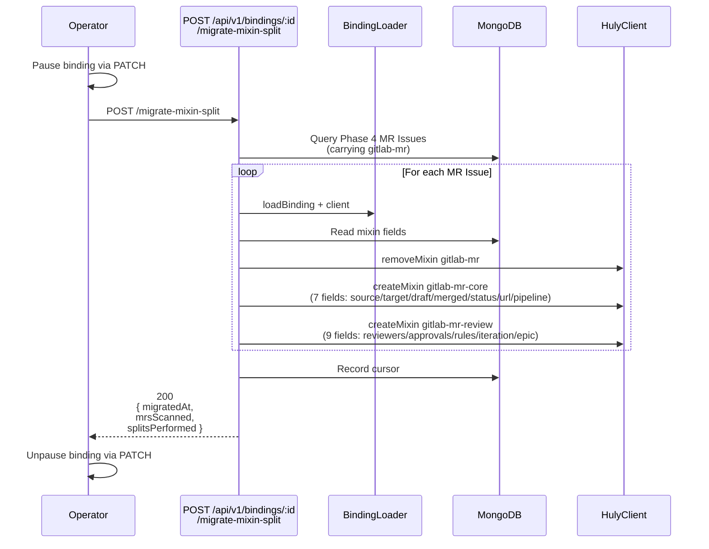

**Field partition:**
- `gitlab-mr-core` (Phase 2–5 MR metadata): `sourceBranch`, `targetBranch`, `draft`, `mergedAt`, `mergeStatus`, `webUrl`, `pipelineStatus`
- `gitlab-mr-review` (Phase 3–5 review/approval): `reviewers`, `approvedBy`, `approvalsRequired`, `approvalStatus`, `diffWebUrl`, `changedFiles`, `approvalRules`, `iteration`, `parentEpicIid`

Phase 4 bindings continue to work with monolithic `gitlab-mr` until migration is run; Phase 5 bindings ship with split mixins.

### GraphQL Capability + REST Fallback Decision

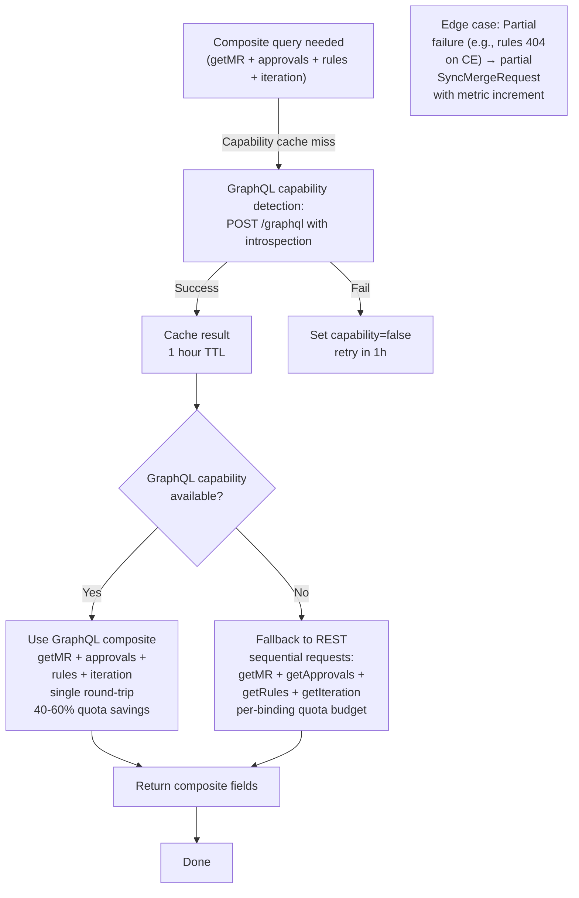

**Strategy:**
- EE instances with GraphQL support: preferred path (single round-trip, 40–60% quota savings on composite getMR)
- CE instances or network error: silent fallback to REST
- Capability cached per GitLab instance; re-checked if cache expires or instance reports version change

---

## Phase 3 Planning Notes

- **Cursor split:** Split `'notes'` into `'issue_notes'` + `'mr_notes'` if backfill metrics show contention.
- **Pipeline backfill:** Implement backfill path for pipelines (Phase 2 is webhook-only; Phase 3 adds periodic catch-up).
- **Reviewers field:** ✓ Phase 3 ships typed `reviewers` field + migration endpoint (replaced Phase 2's synthetic labels).
- **MR creation from Huly:** Implement `applyLocal` intent capture and `createMergeRequest` flow (Phase 4).
